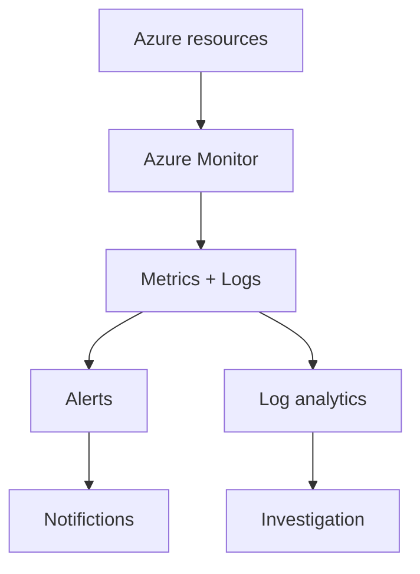

# FabricaTech-Industries---Azure-Monitoring-Incident-Response
This case study is a simulated scenario created for educational purposes. It is inspired by Microsoft Copilot exercises and AI-assisted learning to demonstrate the practical application of Azure security concepts.

# Scenario

***FabricaTech Industries*** is a manufacturing company that operates several production facilities.

The company uses Microsoft Azure to host business applications, production monitoring systems, databases, and other IT resources.

As the production environment becomes more important to the business, the IT team needs to ensure that its Azure resources and applications remain ***available, reliable, and performant.***

The company wants to implement a monitoring strategy that allows the IT team to:

- monitor Azure resources and applications;
- detect performance problems;
- identify service outages;
- analyze logs;
- receive alerts when critical conditions occur;
- respond quickly to incidents.
 
  ## Objectives of study case

Here, we aims to:

### 1- Design a monitoring strategy using Azure Advisor, Azure Service Health, Azure Monitor, Log Analytics, Alerts, and Application Insights.
### 2- Simulate a production-related incident, such as a monitoring application becoming unavailable or very slow, and explain which Azure monitoring tool should be used at each stage of the investigation.
### 3- Design an alerting model with severity levels, thresholds, action groups, and escalation procedures for the production environment.

# Proposed solution approach

### 1. Monitoring Strategy: 
FabricaTech would need to use several Azure services to monitor its production environment, and each service would have a specific role.

|Services | Purposes |
|----------|-------|
|Azure Advisor |will assess FabricaTech's resources and formulate recommendations to improve its Azure environment in order to guarantee its availability, reliability and performance|
|Azure Service Health|To provide information about Azure incidents and planned maintenance|
|Azure Monitor|Monitoring Azure resources and their performance|
|Log Analytics|To analyzes logs in case of problem´s investigation|
|Application Insights|Monitors application performance and errors|
|Alerts|Notifies the IT team when a problem is detected|

### How they work together?

### 2. Scenario Incident 

The application used by employees become ***verry slow or unvailable***
The IT team must identify the cause by following a hierarchical order of operations:

### Step 1 --> Service Health

The IT team first checks Azure Service Health to look for:

- An Azure incident;
- Planned maintenance;
- Or a regional Azure issue.

So then, if no Azure service issue is reported; 

### Step 2 ---> Azure Monitor 

Here, they will examine resource metrics; for example, if the VM CPU usage = 95%, 
It could cause a performance issue due to the excessive consumption.
If no, if everything okay at this stage, the IT team will have to go for:  

### Step 3 --> Application Insights

The team checks the application in ***Application Insights.***
if they find that the application's response time is very high,
it could confirm  the raison of the  application issue. 

If no,

### Step 4 ---> Log Analytics

The team uses Log Analytics to examine the logs.
If it discovers several application errors, they might then have found the root cause and be able to apply a fix.
After applying the fix:

### Step  --> Verifiction
Teams must always run the application to verify that the problem has been correctly resolved after an intervention.

